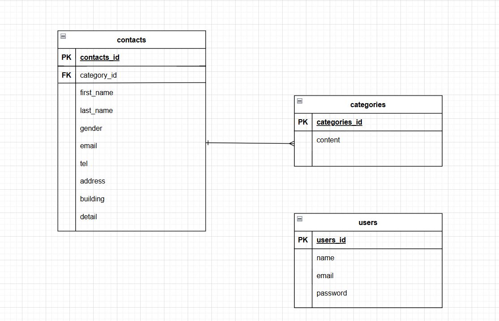

# お問い合わせフォーム

## 環境構築

### Docker ビルド
```
1 git clone https://github.com/koshikawa-minori/check-test.git
2 docker-compose up --build -d
```
>*MySQL は OS によって起動しない場合があります
>その場合は docker-compose.yml を調整してください

### Laravel 環境構築
```
1 docker-compose exec php bash
2 composer install
3 # .env.example から .env を作成し、環境変数を設定
4 php artisan key:generate
5 php artisan migrate
6 php artisan db:seed
```

## 使用技術(実行環境)
- PHP 8.2.29
- Laravel 12.25.0
- MySQL 8.0.26

## ER図


## URL
-アプリケーション(開発環境)：http://localhost/
-DB管理画面(PHPMyAdmin)：http://localhost:8080/